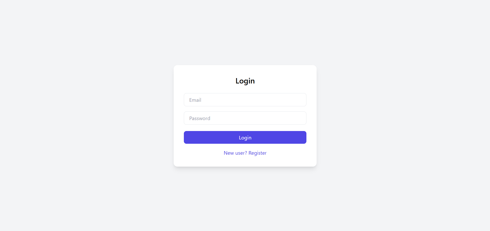
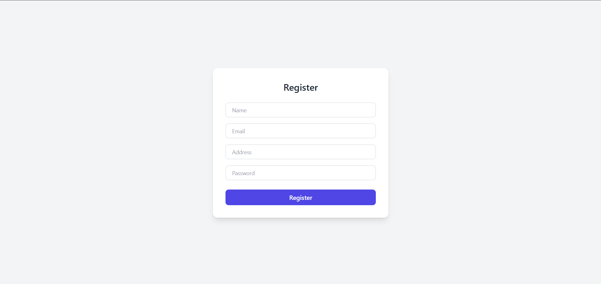

# 🏬 Store Rating Web Application (Full Stack)

A full-stack web application that allows users to rate registered stores based on their experience.  
The platform supports **role-based authentication** with **Admin, Normal User, and Store Owner** access.

---

## 🚀 Features

### 👤 Authentication & Authorization
- Single login system for all users
- Role-based access control
- Secure password handling
- JWT-based authentication

---

### 🛠 User Roles & Functionalities

#### 🔑 System Administrator
- Add new stores, users, and admin accounts
- View dashboard statistics:
  - Total users
  - Total stores
  - Total ratings
- View & filter:
  - Users by name, email, address, role
  - Stores with ratings
- View store owners and their ratings

---

#### 🙋 Normal User
- Register and login
- Update password
- View all registered stores
- Search stores by name and address
- Submit and modify ratings (1–5)
- View:
  - Overall store rating
  - User’s submitted rating

---

#### 🏪 Store Owner
- Login and update password
- View users who rated their store
- View average rating of their store

---

## 🧪 Validations Implemented
- **Name:** 20–60 characters
- **Address:** Max 400 characters
- **Email:** Standard email validation
- **Password:**  
  - 8–16 characters  
  - At least one uppercase letter  
  - At least one special character

---

## 🧰 Tech Stack

### Frontend
- React.js
- React Router
- Axios
- CSS / Bootstrap

### Backend
- Node.js
- Express.js
- JWT Authentication
- bcrypt.js

### Database
- MySQL (mysql2)

---

## 📸 Screenshots

### 🔐 Login Page


### 📝 Register Page


### 🧑‍💼 Admin Dashboard


### 🏬 Store Listing & Rating


---

## ⚙️ Installation & Setup

### 1️⃣ Clone Repository
```bash
git clone https://github.com/your-username/store-rating-app.git
cd store-rating-app
